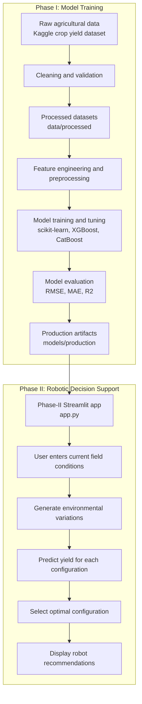

# Architecture Overview

This project has two connected layers:

1. Phase I builds the trained regression pipelines from agricultural data.
2. Phase II uses those production pipelines to recommend environment adjustments for a crop field.

## High-Level Flow

```text
Raw crop yield dataset
    ↓
Data cleaning and validation
    ↓
Feature engineering and preprocessing
    ↓
Model training and hyperparameter tuning
    ↓
Model evaluation and selection
    ↓
Production artifacts in models/production
    ↓
Streamlit phase-II app
    ↓
Current field inputs → environment variations → yield prediction → best configuration
    ↓
Robot-friendly recommendations
```

## Mermaid Diagram



## System Boundaries

- Phase I is experimental and focuses on building the best yield prediction model.
- Phase II is a decision-support layer that consumes the trained model outputs.
- The robot actions shown in the phase-II concept are recommendations, not a verified autonomous control loop.

## Key Runtime Inputs

- Crop type
- Season
- State
- Area
- Annual rainfall
- Fertilizer per area
- Pesticide per area

The app loads the champion model by default and keeps a rollback model available for comparison or fallback.
